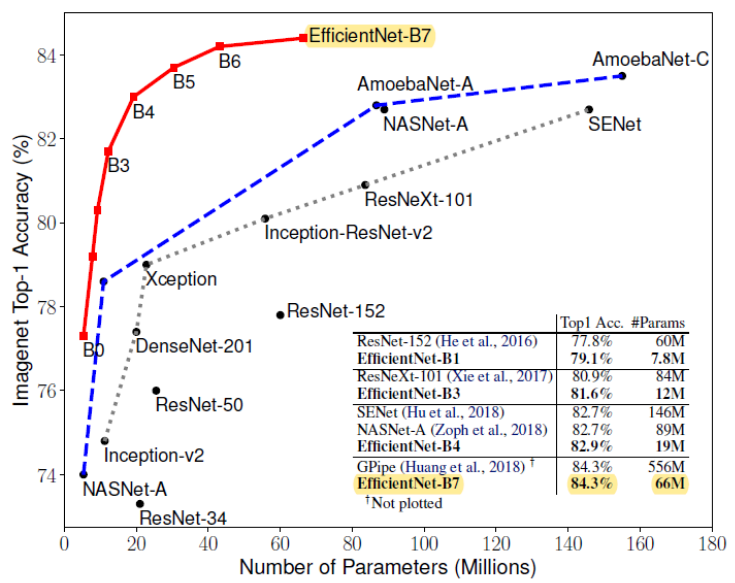
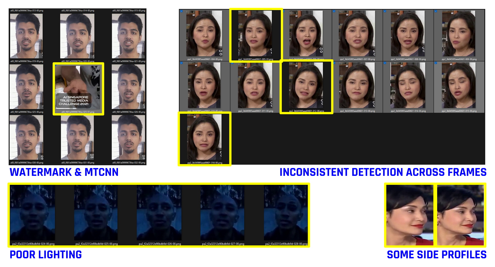

#  Capstone Project: Deep Fakes Detector

## Background

Deep fakes (a combination of "[*deep learning*](https://en.wikipedia.org/wiki/Deep_learning)" and "fake") are synthetic media in which a person in an existing image or video is replaced with someone similar. While the creation of fake content is not new, deep fakes leverage powerful techniques from artificial intelligence and machine learning to produce audio and/or visual content that can more easily deceive.

The main machine learning methods used to create deep fakes are based on deep learning and involve training generative neural network architectures, such as [*generative adversarial networks (GANs)*](https://en.wikipedia.org/wiki/Generative_adversarial_network).

Deep fakes have many potential applications across multiple industries and domains, including but not limited to:
 - [*Art*](https://digitalsynopsis.com/design/samsung-living-portrait/)
 - [*Charity*](https://abcnews.go.com/International/david-beckham-speaks-languages-campaign-end-malaria/story?id=62270227)
 - [*Entertainment*](https://youtu.be/mPU0WNUzsBo)
 - [*Gaming*](https://www.theverge.com/2018/12/3/18121198/ai-generated-video-game-graphics-nvidia-driving-demo-neurips)
 - [*Healthcare*](https://www.fastcompany.com/90240746/deepfakes-for-good-why-researchers-are-using-ai-for-synthetic-health-data)
 - [*History*](https://www.theverge.com/2019/5/10/18540953/salvador-dali-lives-deepfake-museum)
 - [*Public Service*](https://youtu.be/cQ54GDm1eL0)
 - etc.

However, deep fakes garnered widespread attention for their uses in creating child sexual abuse material, [*celebrity pornographic videos*](https://www.highsnobiety.com/p/what-are-deepfakes-ai-porn/), [*revenge porn*](https://en.wikipedia.org/wiki/Revenge_porn), [*fake news*](https://en.wikipedia.org/wiki/Fake_news), hoaxes, bullying, financial fraud, etc. This has elicited responses from both industry ([*Source*](https://thenextweb.com/news/twitter-pornhub-and-other-platforms-ban-ai-generated-celebrity-porn)) and government ([*Source*](https://www.congress.gov/bill/116th-congress/house-bill/3230)) to detect and limit their use. In a July 2021 study commissioned by the Panel for the Future of Science and Technology, Scientific Foresight Unit (STOA), European Parliament titled "[*Tackling deepfakes in European policy*](https://www.europarl.europa.eu/thinktank/en/document/EPRS_STU(2021)690039)", the authors highlighted similar concerns and more (See Table below):

**Overview of different types of risks associated with deepfakes**

| **Psychological Harm** | **Financial Harm**             | **Societal Harm**                 |
|------------------------|--------------------------------|-----------------------------------|
| [*(S)extortion*](https://timesofindia.indiatimes.com/city/ahmedabad/deepfakes-replace-women-on-sextortion-calls/articleshow/86020397.cms)           | Extortion                      | News media manipulation           |
| Defamation             | [*Identity theft*](https://mashable.com/article/deepfake-job-interviews-fbi)                 | Damage to economic stability      |
| Intimidation           | [*Fraud (e.g. insurance/payment)*](https://www.forbes.com/sites/thomasbrewster/2021/10/14/huge-bank-fraud-uses-deep-fake-voice-tech-to-steal-millions/) | Damage to justice system          |
| Bullying               | Stock-price manipulation       | Damage to scientific system       |
| Undermining trust      | Brand damage                   | Erosion of trust                  |
|                        | Reputational damage            | Damage to democracy               |
|                        |                                | Manipulation of elections         |
|                        |                                | Damage to international relations |
|                        |                                | [*Damage to national security*](https://www.npr.org/2022/03/16/1087062648/deepfake-video-zelenskyy-experts-war-manipulation-ukraine-russia)       |

In Singapore, [*AI Singapore*](https://aisingapore.org/) launched a five-month long "[*Trusted Media Challenge*](https://www.channelnewsasia.com/singapore/ai-singapore-launches-competition-design-solutions-detecting-fake-media-2017431)" on 15 July 2021 with the Trusted Media Challenge (TMC) dataset for contestants to design solutions that will help detect fake media.

During a presentation at the recently concluded Singapore Defence Technology Summit on 14 Oct 2021, Associate Professor Hao Li, founder of Pinscreen, a start-up that develops photorealistic AI-driven virtual avatars, opined that the most nefarious is how deep fakes could disrupt national security, by spreading misinformation and influencing public opinion ([*Source*](https://www.channelnewsasia.com/singapore/deepfakes-ai-security-threat-face-swapping-2252161)). Assoc Prof Li also taught computer science at the University of Southern California.

In case we think that most of us are literally just ordinary persons who would be unlikely targets of potential deep fakes exploits, the recent case of a Singaporean man's face ending up in deep fake porn on 21 Apr 2022 after he refuses to pay hacker SGD 8,000 hits really close to home! ([*Source*](https://news.yahoo.com/singaporean-mans-face-ends-deepfake-171743924.html))

All these inspired me to apply what I have learnt to establish a functional process workflow and develop a Deep Fake Detector potentially capable of discerning deep fake videos from real ones.

Cognizant of the systemic bias of AI models against underrepresented grouped data, as well as many deep fake detectors being sensitive to skin tones and other face features, I requested with [*AI Singapore*](https://aisingapore.org/) for the TMC Dataset which focuses on Asian content and ethnicities because other datasets usually have a majority of Caucasians. This potentially ensures greater relevance of the AI model developed to the broader Asian region.

## Problem Statement

Establish a functional process workflow and develop an **AI model** with a **dataset focused on Asian content and ethnicities** that **detects and correctly identifies deep fakes videos (excluding their audio component)** with an **accuracy of at least 80%** as my humble contribution towards the ongoing efforts of the Data Science community, industries, and governments alike, in combating deep fakes exploits and applying Artificial Intelligence (AI) technologies towards serving the greater good of the general public.

## Trusted Media Challenge (TMC) Dataset

The dataset used here is the Trusted Media Challenge (TMC) dataset released by [*AI Singapore*](https://aisingapore.org/), comprising of 4,380 fake and 2,563 real videos, with various video and/or audio manipulation methods employed to produce different types of fake media.

**Key Features of the TMC dataset**:
1. Videos in dataset focus on Asian content and ethnicities.
2. Videos (with audios included) vary in durations, background, illumination, and may contain perturbations that mimic transmission errors and compression.
3. The 222 consented subjects in these videos are either Professionals or Amateurs:
   - **Professionals**: [*CNA*](https://www.channelnewsasia.com/) news presenters and journalists talking in news programs, and [*ST*](https://www.straitstimes.com/) interviewees answering questions in interview programs.
   - **Amateurs**: Freelancers talking about different topics like interest, movies, food, etc.
4. There are 4 different types of fake media in the TMC dataset:

| **Type**   | **Video**  | **Audio**  | **Percentage** |
|------------|------------|------------|----------------|
| 1          | Fake       | Fake       | 20.24%         |
| 2          | Fake       | Real       | 22.97%         |
| 3          | Real       | Fake       | 9.07%          |
| 4          | Real       | Real       | 10.80%         |
| **_[ Blank ]_** | **_Real_** | **_Real_** | **_36.92%_**   |

5. For Type-4 (See above), while both the videos and audios are real, the speech content does not match the mouth movement in the videos i.e. the video footage from one real video is combined with the audio segment from another real video to create a new medium. Therefore, it is regarded as fake medium too.

Refer to the **[*AI Singapore Trusted Media Challenge Dataset*](https://arxiv.org/abs/2201.04788.pdf)** paper submitted by [*AI Singapore*](https://aisingapore.org/) dated 08 Mar 2022 for details.

The TMC dataset is also available for research purpose upon request via [*tmc-dataset@aisingapore.org*](mailto:tmc-dataset@aisingapore.org).

### Data Dictionary

**CSV Files**:
- **`_train.csv_`**: Initial csv file with new data labels and file sizes included. New data labels and file sizes were not provided by AI Singapore.
- **`_train_data.csv_`**: csv file for the TMC dataset of 6,943 real and fake videos with additional information included. 
- **`_train_subset.csv_`**: csv file for the initial subset of 2,080 real and fake videos from the TMC dataset.
- **`_train_faces_subset.csv_`**: csv file for the final subset of 1,560 real and fake videos from the TMC dataset.
- **`_testerTMC.csv_`**: csv file for the 12 **NEW** videos that was used in the TMC Sample Test to ascertain the robustness of the trained model.

Data dictionary for **`_train.csv_`** (last 4 features are not applicable), **`_train_data.csv_`**, **`_train_subset.csv_`**, **`_train_faces_subset.csv_`**, and **`_testerTMC.csv_`**:

| **Feature**   | **Type** | **Description**                                                                                                                                                                                                                                                                                                                                                                                                                                                                                                                                                                                                                                                                                                                                                                                                                                                                                                                                                                                                                                                                                                                                                                                                   |
|---------------|----------|-------------------------------------------------------------------------------------------------------------------------------------------------------------------------------------------------------------------------------------------------------------------------------------------------------------------------------------------------------------------------------------------------------------------------------------------------------------------------------------------------------------------------------------------------------------------------------------------------------------------------------------------------------------------------------------------------------------------------------------------------------------------------------------------------------------------------------------------------------------------------------------------------------------------------------------------------------------------------------------------------------------------------------------------------------------------------------------------------------------------------------------------------------------------------------------------------------------------|
| filename      | string   | Alphanumeric file name of each video file in mp4 format with video resolution of 360p or 1080p                                                                                                                                                                                                                                                                                                                                                                                                                                                                                                                                                                                                                                                                                                                                                                                                                                                                                                                                                                                                                                                                                                                    |
| srcDataSource | string   | Source video featuring source person from which fake video will be generated. **Professionals**: CNA news presenters and journalists as well as ST interviewees **Amateurs**: Freelancers                                                                                                                                                                                                                                                                                                                                                                                                                                                                                                                                                                                                                                                                                                                                                                                                                                                                                                                                                                                                                   |
| trgDataSource | string   | Target video featuring target person. **Professionals**: CNA news presenters and journalists as well as ST interviewees **Amateurs**: Freelancers **[ Blank ]**: Real video                                                                                                                                                                                                                                                                                                                                                                                                                                                                                                                                                                                                                                                                                                                                                                                                                                                                                                                                                                                                                              |
| videoType     | string   | **Type-1**: Fake video and fake audio **Type-2**: Fake video and real audio **Type-3**: Real video and fake audio **Type-4**: Real video and real audio **[ Blank ]**: Real video with audio Refer to points 4 and 5 above for details.                                                                                                                                                                                                                                                                                                                                                                                                                                                                                                                                                                                                                                                                                                                                                                                                                                                                                                                                                            |
| new_label     | integer  | **0**: Real video **1**: Fake video                                                                                                                                                                                                                                                                                                                                                                                                                                                                                                                                                                                                                                                                                                                                                                                                                                                                                                                                                                                                                                                                                                                                                                            |
| label         | string   | **a00**: Real video of Amateur **p00**: Real video of Professional **aa1**: Type-1 Fake video from Amateur source and target **aa2**: Type-2 Fake video from Amateur source and target **aa3**: Type-3 Fake video from Amateur source and target **aa4**: Type-4 Fake video from Amateur source and target **ap1**: Type-1 Fake video from Amateur source and Professional target **ap2**: Type-2 Fake video from Amateur source and Professional target **ap3**: Type-3 Fake video from Amateur source and Professional target **ap4**: Type-4 Fake video from Amateur source and Professional target **pp1**: Type-1 Fake video from Professional source and target **pp2**: Type-2 Fake video from Professional source and target **pp3**: Type-3 Fake video from Professional source and target **pp4**: Type-4 Fake video from Professional source and target **pa1**: Type-1 Fake video from Professional source and Amateur target **pa2**: Type-2 Fake video from Professional source and Amateur target **pa3**: Type-3 Fake video from Professional source and Amateur target **pa4**: Type-4 Fake video from Professional source and Amateur target |
| size          | integer  | File size in kilobyte (KB)                                                                                                                                                                                                                                                                                                                                                                                                                                                                                                                                                                                                                                                                                                                                                                                                                                                                                                                                                                                                                                                                                                                                                                                        |
| frame_count   | float    | Number of frames in the video file                                                                                                                                                                                                                                                                                                                                                                                                                                                                                                                                                                                                                                                                                                                                                                                                                                                                                                                                                                                                                                                                                                                                                                                |
| fps           | float    | Frame rate in frames per second (FPS)                                                                                                                                                                                                                                                                                                                                                                                                                                                                                                                                                                                                                                                                                                                                                                                                                                                                                                                                                                                                                                                                                                                                                                             |
| duration      | float    | Duration of video in seconds (s)                                                                                                                                                                                                                                                                                                                                                                                                                                                                                                                                                                                                                                                                                                                                                                                                                                                                                                                                                                                                                                                                                                                                                                                  |
| images        | integer  | Number of still images captured from video (in subsequent preprocessing steps)                                                                                                                                                                                                                                                                                                                                                                                                                                                                                                                                                                                                                                                                                                                                                                                                                                                                                                                                                                                                                                                                                                                                    |

The following are the detailed breakdown of the 2,080 initial and 1,560 final subsets of real and fake videos from the TMC dataset, as well as the 12 **NEW** TMC dataset videos (for the Sample Test), used:

| **label** | **srcDataSource** | **trgDataSource** | **videoType** | **new_label** | **Quantity** | **Remarks** | **Initial Subset (2080 Videos)** | **Final Subset (1560 Videos)** | **TMC Sample Test (12 Videos)** |
|-----------|-------------------|-------------------|---------------|---------------|--------------|-------------|----------------------------------|--------------------------------|---------------------------------|
| aa1       | amateur           | amateur           | Type-1        | 1             | 65           | FAKE        | ✓                                | ✓                              | 1                               |
| aa2       | amateur           | amateur           | Type-2        | 1             | 65           | FAKE        | ✓                                | ✓                              | 1                               |
| aa3       | amateur           | amateur           | Type-3        | 1             | 65           | FAKE        | ✓                                |                                |                                 |
| aa4       | amateur           | amateur           | Type-4        | 1             | 65           | FAKE        | ✓                                |                                |                                 |
| ap1       | amateur           | professional      | Type-1        | 1             | 65           | FAKE        | ✓                                | ✓                              | 1                               |
| ap2       | amateur           | professional      | Type-2        | 1             | 65           | FAKE        | ✓                                | ✓                              | 1                               |
| ap3       | amateur           | professional      | Type-3        | 1             | 65           | FAKE        | ✓                                |                                |                                 |
| ap4       | amateur           | professional      | Type-4        | 1             | 65           | FAKE        | ✓                                |                                |                                 |
| pa1       | professional      | amateur           | Type-1        | 1             | 65           | FAKE        | ✓                                | ✓                              | 1                               |
| pa2       | professional      | amateur           | Type-2        | 1             | 65           | FAKE        | ✓                                | ✓                              | 1                               |
| pa3       | professional      | amateur           | Type-3        | 1             | 65           | FAKE        | ✓                                |                                |                                 |
| pa4       | professional      | amateur           | Type-4        | 1             | 65           | FAKE        | ✓                                |                                |                                 |
| pp1       | professional      | professional      | Type-1        | 1             | 65           | FAKE        | ✓                                | ✓                              | 1                               |
| pp2       | professional      | professional      | Type-2        | 1             | 65           | FAKE        | ✓                                | ✓                              | 1                               |
| pp3       | professional      | professional      | Type-3        | 1             | 65           | FAKE        | ✓                                |                                |                                 |
| pp4       | professional      | professional      | Type-4        | 1             | 65           | FAKE        | ✓                                |                                |                                 |
| **a00**   | **amateur**       |                   |               | **0**         | **520**      | **REAL**    | **✓**                            | **✓**                          | **2**                           |
| **p00**   | **professional**  |                   |               | **0**         | **520**      | **REAL**    | **✓**                            | **✓**                          | **2**                           |

**Notes**:
- During Train-Test Split, all 520 Type-1 and Type-2 fake videos are selected while another 520 out of the 1040 real videos are randomly selected for use.
- 12 **NEW** Videos from the same TMC dataset was used in the TMC Sample Test to ascertain the robustness of the trained model. These 12 **NEW** Videos have **never been used** as part of the initial Train, Validation, and Test datasets, and has undergone the same project steps 1, 2 and 5 detailed below before uploading to Google Drive.

## Project Scope

For the purpose of this project, a subset of the Trusted Media Challenge (TMC) dataset released by [*AI Singapore*](https://aisingapore.org/) is used to create a [*Convolutional Neural Network (CNN)*](https://en.wikipedia.org/wiki/Convolutional_neural_network) for potential detection of [*deepfake*](https://en.wikipedia.org/wiki/Deepfake) videos based on the **video component only** (i.e. **Type-1** and **Type-2** fake videos **only**). Detection of Type-3 and Type-4 fake videos is **not** within this project's scope.

---

## Overall Project Workflow

We will perform the following steps for data preprocessing, [*Exploratory Data Analysis (EDA)*](https://en.wikipedia.org/wiki/Exploratory_data_analysis), model training and assessment:

**Data Preprocessing**

`[ Notebook: **A -- Relabel & Convert Each Video To Images** ]`

1. Relabel all 6,943 videos' filenames
2. Capture frames from each video in PNG format & scale all images to 1080 pixels

`[ Notebook: **B -- Obtain Videos Parameters & Move Video Subset** ]`

3. Obtain additional videos' parameters [**_Optional_**]
    - frame count
    - fps
    - duration (_derived_)
    - number of images that will be extracted per video (_derived_)
4. Move all 2,080 initial subset of videos to new folder [**_Optional_**]

`[ Notebook: **C -- Crop Faces With MTCNN** ]`

5. Detect, crop & save faces to subfolder

`[ Notebook: **D -- Train-Test Split** ]`

6. Prepare Train, Validation & Test Folders
    - Upload zipped file of split dataset "**_split_dataset.zip_**" to [*Kaggle*](https://www.kaggle.com/) as private dataset

`[ Notebook: **E -- Exploratory Data Analysis (EDA)** ]`

7. Exploratory Data Analysis (EDA)
    - Compare Mean Real Image & Mean Fake Image
    - Compare contrast between Mean Images
    - Compare Standard Deviation Real Image & Standard Deviation Fake Image
    - Compare contrast between Standard Deviation Images

`[ Notebook: **F -- Train Model** ]` (_This Notebook runs in **Google Colab** instead_)

8. Train the chosen CNN classifier model
    - Mount Google Drive
    - Install and/or import required libraries / packages
    - Download and unzip private split dataset from [*Kaggle*](https://www.kaggle.com/)
    - Set global random seed, directories, batch size, image size
    - Prepare train, validation and test datasets, including rescaling as appropriate according to choice of CNN classifier model
    - Apply image augmentations on train dataset
    - Load CNN classifier model pretrained on [*ImageNet*](https://image-net.org/)
    - Add additional layers to CNN classifier model as appropriate and compile final model
    - Set up early stopping, reduce learning rate on plateau, and save best model at checkpoint
    - Initial training of model
    - Plot Learning Curves
    - Recompile model with reduced learning rate
    - Fine tuning training of model
    - Plot Combined Learning Curves
    - Load best model's saved weights values, architecture, training configuration, optimizer and its state
    - Generate predictions with best model
    - Generate corresponding Confusion Matrix, Receiver Operating Characteristic (ROC) and Classification Report
    - Apply Best Model to predict faces extracted from 12 new TMC dataset videos
9. Limitations, Future Work, Recommendations, and Conclusion

---

### Exploratory Data Analysis (EDA)

One of the Exploratory Data Analyses (EDA) done were plots of the Average Real, Average Fake, and their difference as shown below:

- Both greyscale images look quite similar at first glance.
- On closer inspection, the forehead, nosebridge, chin and both cheek regions below the eyes appear brighter (i.e. lighter shade of grey) in the Average REAL image versus the Average FAKE image.
- In respect of the DIFFERENCE image on the right, the face and upper body regions appear red which is reasonably expected since any deepfake video manipulations made would generally focus on these regions too.
- A watermark is present typically near the lower right corner of a face in all video frames, and may be partially visible on sample cropped faces. This potentially explains why the bottom right and right centre regions appear red in this contrast average image (See **Green** boxed region).

---

### Convolutional Neural Network (CNN) Model: EfficientNet-B7

The CNN model used in this project is the **EfficientNet-B7** because it significantly outperforms other CNNs to achieve new state-of-the-art 84.3% top-1 accuracy while being 8.4x smaller and 6.1x faster than GPipe. ([*Source*](https://arxiv.org/pdf/1905.11946.pdf))

---

### Convolutional Neural Network (CNN) Model Results Discussion

 - CNN Model's Accuracy on test dataset: 99%

 - CNN Model's Accuracy on **unseen** test dataset of 12 **NEW** videos: 80.76%

Based on the preliminary results from the test dataset, an accuracy of **99%** is achieved for the CNN model developed. However, in this sample test dataset created using 12 **NEW** videos that were not part of the initial Train / Validation / Test datasets, an accuracy of **80.76%** is achieved instead. This implies that the Model may have overfitted onto the datasets it was trained on.

Examples of successful image detection are shown below:

The **best_model.h5** file generated is available [*here*](https://drive.google.com/file/d/1CzSyXecgzbUfDajbjYTspTPJteVpChm-/view?usp=sharing).

---

### Limitations

As highlighted in the Project Scope above, a subset of the Trusted Media Challenge (TMC) dataset released by [*AI Singapore*](https://aisingapore.org/) is used to create a [*Convolutional Neural Network (CNN)*](https://en.wikipedia.org/wiki/Convolutional_neural_network) for potential detection of [*deepfake*](https://en.wikipedia.org/wiki/Deepfake) videos based on the **video component only** (i.e. **Type-1** and **Type-2** fake videos **only**). Thus, detection of Type-3 and Type-4 fake videos is **not** within this project's scope, and will be part of the list of limitations of this CNN model developed.

Additional limitations include and are not limited to the following:
- This CNN model may also be unable to detect fake videos generated using other techniques or algorithms that differ from the following 3 video manipulations applied to the TMC dataset:
   - Deepfakes-256/512
   - FSGAN
   - FaceSwap
- Potential degradation of model performance across datasets different from this TMC dataset due to **domain shift**, i.e. the data distribution change between the training and testing set.
   - This is due to change in the image quality of real videos and deep fakes following the continuous advances in sensor technology and the deep fake generation techniques.
   - Systemic bias of AI models against underrepresented grouped data, as well as many deep fake detectors being sensitive to skin tones and other face features, may also be contributory factors to any model performance degradations.
   - If changes are made to the preprocessing steps, model performance may also differ.
- Each video in this TMC dataset generally contains 2 watermarks, 1 at the bottom left corner of the video and another just to the bottom right of the face. As highlighted by AI Singapore, this is not regarded as perturbation but may still have an impact on some fake detectors, including this one.
- Accuracy of Multi-task Cascaded Convolutional Networks (MTCNN) used in step 5 of project workflow needs to be fine tuned.
- Inconsistent detection across frames on same video.
- Difficulty and/or inability to detect some side profiles and/or in poor lighting.

The following are some samples illustrating some of this model's limitations, such as inconsistent deep fakes detection across video frames, inability to detect for some face side profiles and in poor lighting.

---

### Future Work

Since the preliminary results produced by this CNN model appear promising, this warrants further exploratory next steps that include and are not limited to the following:
 1. Explore ways for potentially deploying the CNN Model as a minimum viable product (MVP), while continually refining it and eventually including additional related detection modules to improve its robustness.
 2. Extend the training to the full set of Type-1 and Type-2 videos.
 3. Explore real time detection.
 4. Examine the impact of scaling all images converted from videos in step 2 of process workflow detailed above to say 360 pixels, as opposed to scaling to 1080 pixels currently.
 5. Explore using other pretrained models such as VGGnet, InceptionV3, and Resnet and compared performance against that produced using EfficientNetB7.
 6. Explore the design of an additional model such as one that converts the audio components into say Mel Spectrograms for training to potentially detect deep fake audios from real audios in these TMC videos.
 7. Explore the design of yet an additional model such as a lip-sync detector that potentially detects Type-4 deep fakes videos, whereby both the videos and audios are real but the speech content does not match the mouth movement in the videos i.e. the video footage from one real video is combined with the audio segment from another real video to create a new medium.
 8. Explore training the (combined) deep fake detection module(s) with other datasets to improve its robustness.

---

### Recommendations

In spite of the limitations highlighted above, since preliminary results from the test dataset and the subsequent sample test dataset of 12 **NEW** videos that were not part of the initial Train / Validation / Test datasets yielded accuracies of **99%** and **80.76%** respectively, this CNN model serves as a good starting point for anyone who is keen to potentially:
 - deploy the model for deep fakes video detection based on the video component only (i.e. Type-1 and Type-2 fake videos only); and/or
 - further improve the model's accuracy; and/or
 - enhance its capabilities with additional detection modules; and/or
 - train the model with other relevant datasets.

The following is a mock-up of potential deep fakes detection deployment:

---

### Conclusion

In conclusion, I established a functional process workflow and developed a **Convolutional Neural Network (CNN)** with a **dataset focused on Asian content and ethnicities** that potentially **detects and correctly identifies deep fakes videos (excluding their audio component)** with an **accuracy of 80.76%** as my humble contribution towards the ongoing efforts of the Data Science community, industries, and governments alike, in combating deep fakes exploits and applying Artificial Intelligence (AI) technologies towards serving the greater good of the general public, thereby meeting the objectives set out by the Problem Statement.

---

## Acknowledgements

Special thanks to [*AI Singapore*](https://aisingapore.org/) for making available the TMC dataset and answering my various clarifications in respect of this Capstone Project:

@article{chen2022ai,
  title={AI Singapore Trusted Media Challenge Dataset},
  author={Chen, Weiling and Chua, Benjamin and Winkler, Stefan},
  journal={arXiv preprint arXiv:2201.04788},
  year={2022}
}

My heartfelt appreciation also goes to my Data Science Immersive (DSI) Lead Instructor, Mr. Kishan S., then DSI Instructional Associate (now Lead Instructor), Mr. Ryan Chang, and DSI Instructional Associate, Mr. Amir Yunus, for their guidance and support throughout my Data Science learning journey with General Assembly Singapore during the past 3 months.